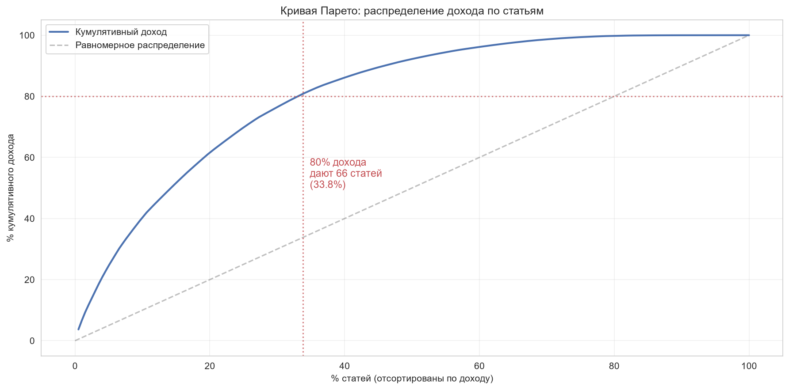
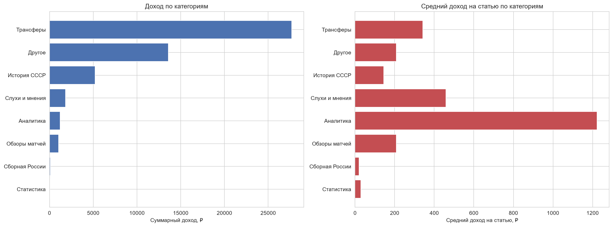
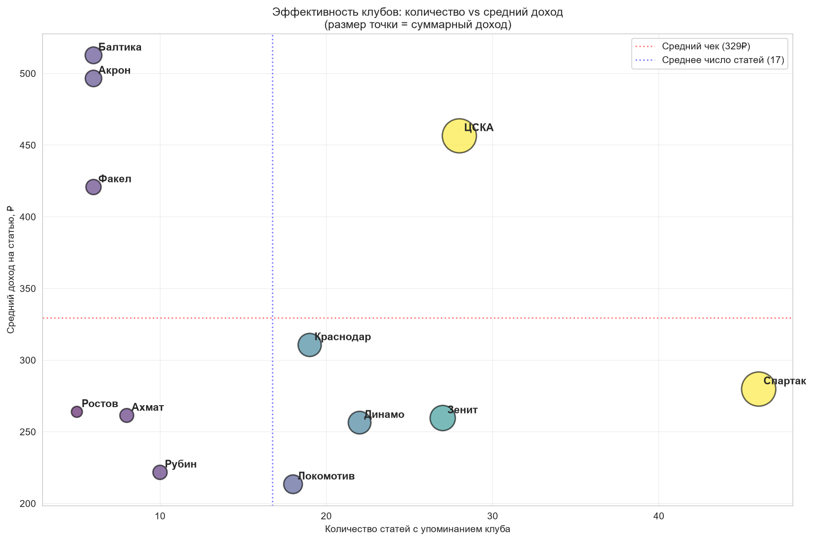
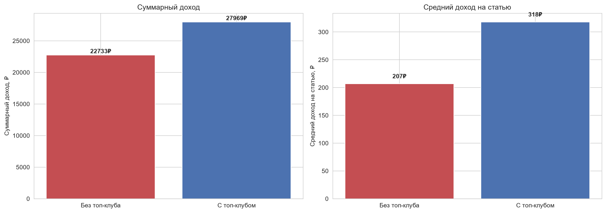
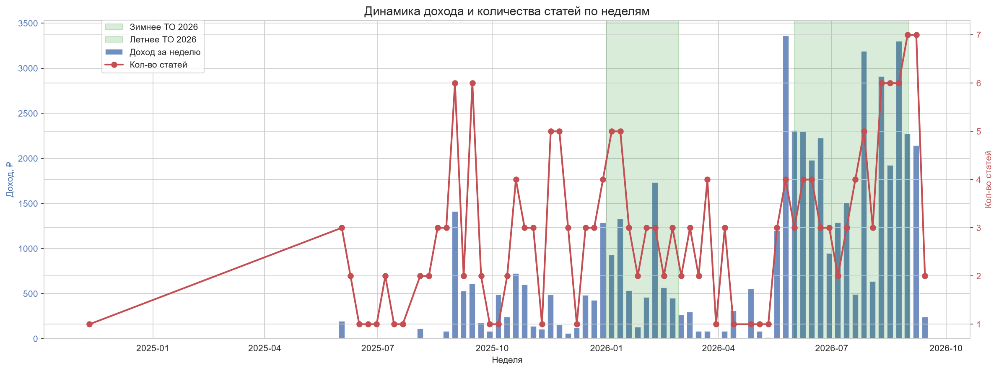
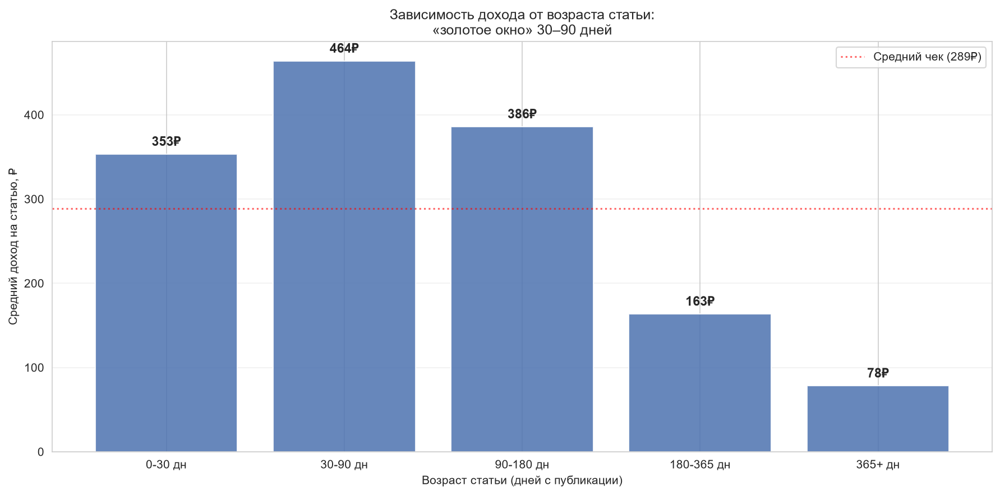
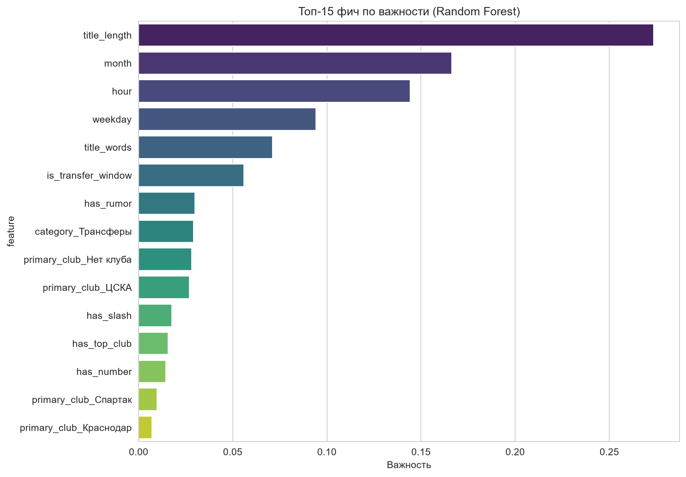
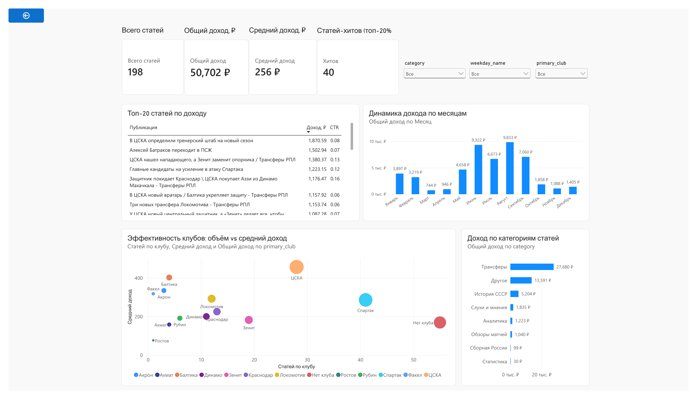

# 📊 Анализ контент-стратегии канала «Время Футбола» на Дзене

**Кейс:** 198 статей, 50 702 ₽ дохода за год, 6 бизнес-инсайтов, ML-эксперимент и дашборд в Power BI.  
**Стек:** Python · pandas · scikit-learn · Power BI

Анализ реального канала на Дзене в нише «российский футбол»: какие темы, 
клубы и форматы приносят доход, как сезонность влияет на метрики, 
и можно ли предсказать «хит».

## 🎯 Бизнес-задача

Канал существует 4 года, публикует статьи о российском футболе. 
Доход нестабилен: от 0.03 ₽ до 1870 ₽ за статью. 

**Задача:** выявить ключевые факторы дохода, понять сезонность 
и предложить стратегию контента на основе данных.

## 📊 Данные

- **Источник:** выгрузка из Студии Дзена (2 файла: доход + статистика).
- **Период:** ноябрь 2024 — сентябрь 2026.
- **Объём:** 614 публикаций, из них 198 статей с доходом.
- **Признаки:** дата, тип, тема, CTR, дочитывания, комментарии, лайки, доход.

## 🔍 Ключевые инсайты

### 1. Правило Парето: треть статей даёт 80% дохода

*50% дохода — 29 статей (14.6%), 80% — 66 статей (33.3%).*

### 2. Трансферы — 55% дохода

*Трансферные статьи — 41% контента, но 55% дохода. 
«Аналитика» и «Слухи» — высокий средний чек (458–1223 ₽), но мало статей.*

### 3. ЦСКА — оптимальный клуб для контента

*Спартак и ЦСКА идут вровень по суммарному доходу (12 872 ₽ vs 12 782 ₽), 
но ЦСКА — за 28 статей, Спартак — за 46. Средний чек: 456 ₽ vs 280 ₽. 
Балтика, Акрон, Факел — высокий чек (400–500 ₽), но мало статей.*

### 4. Топ-клубы дают ×1.5 к среднему

*Статьи с упоминанием ЦСКА/Спартака/Зенита: 318 ₽ против 207 ₽.*

### 5. Сезонность: трансферные окна в 3–5 раз доходнее

*Пики дохода — январь–февраль и июнь–сентябрь. Межсезонье — 100–800 ₽/неделю.*

### 6. «Золотое окно» статьи — 30–90 дней

*Средний доход: 464 ₽ в окне 30–90 дней, 78 ₽ через год. 
83% дохода приносят статьи моложе 180 дней.*

## 🤖 Моделирование: честный эксперимент

### Задача
Классификация: попадёт ли статья в топ-20% по доходу (порог 449 ₽).

### Результаты

| Модель                             | ROC-AUC   | Recall (хит) | Precision (хит) |
|------------------------------------|-----------|--------------|-----------------|
| Random Forest (baseline)           | 0.536     | 0.14         | 1.00            |
| Random Forest + `days_since_start` | **0.679** | 0.21         | 0.75            |

### Интерпретация

**Baseline ROC-AUC = 0.536** — модель практически не различает хиты 
и обычные статьи. Это **не провал модели**, а фундаментальное свойство данных:

1. **Временной дрейф.** Средний доход канала вырос в 3.5 раза за год 
   (108 ₽ → 382 ₽ по фолдам TimeSeriesSplit).
2. **Test — аномальный период** (летнее трансферное окно 2026).
3. **Алгоритм Дзена — чёрный ящик.** Реальные драйверы (попадание 
   в ленту, актуальность) не наблюдаемы в данных.

**С `days_since_start` ROC-AUC = 0.679** — рост подтверждает гипотезу 
о дрейфе. Но эта фича недоступна в реальном применении (data leakage).

### Feature Importance



Даже в baseline-модели **`title_length` (0.27) — топ-1**. Это значит: 
**заголовок важнее всего**. Длинные заголовки (трансферные дайджесты с `/`) 
дают больше дохода.

### Что это значит для бизнеса

**ML не заменяет экспертизу.** При 198 статьях и сильном тренде модель 
не может предсказывать хиты. Рекомендуется перезапустить моделирование 
при накоплении 500+ статей.

## 📊 Дашборд



*Интерактивный дашборд в Power BI: KPI, динамика дохода, категории, 
эффективность клубов, топ-20 статей. Фильтры по категории, клубу, дню недели.*

Исходник: [`dashboard/dzen_dashboard.pbix`](dashboard/dzen_dashboard.pbix)

## 💡 Бизнес-рекомендации

1. **Приоритет — трансферы и ЦСКА.** Трансферные статьи с упоминанием ЦСКА 
   дают максимальный средний чек (456 ₽). Увеличить их долю с 28 до 40 статей.

2. **Нарастить «Аналитику» и «Слухи».** Средний чек 458–1223 ₽ при 1–4 статьях — 
   недоиспользованный потенциал. Целевой объём: 1–2 статьи в неделю.

3. **В трансферные окна — 5–7 статей в неделю.** Летнее ТО 2026: 
   пик 9 800 ₽/месяц против 700 ₽ в межсезонье.

4. **Публиковать регулярно.** 83% дохода — статьи моложе 180 дней. 
   Старые статьи «умирают» — доход падает в 6 раз.

5. **Заголовки — длиннее и с разделителем `/`.** `has_slash` и `title_length` 
   в топ-3 фич по важности.

6. **Не перекармливать Спартак.** 46 статей vs 28 у ЦСКА при равном доходе — 
   перепроизводство.

## ⚠️ Ограничения

- **Период — 1 год.** Нельзя анализировать долгосрочный тренд.
- **Доход зависит от алгоритма Дзена** — это не чистая причинность.
- **Метрики накопительные.** Статья «дозревает» месяцами.
- **Нет данных о подписчиках** и источниках трафика.
- **ML не сработал** из-за временного дрейфа и малого объёма данных.

## 🛠 Стек

- **Python 3.13** — pandas, numpy, scikit-learn, matplotlib, seaborn
- **Power BI** — интерактивный дашборд
- **Jupyter Notebook** — EDA и моделирование

## 📁 Структура проекта
dzen-analysis/
├── data/
│ ├── raw/ # исходные xlsx
│ └── processed/ # очищенные csv
├── notebooks/
│ ├── 01_eda.ipynb
│ └── 02_modeling.ipynb
├── images/ # визуалы для README
├── dashboard/
│ └── dzen_dashboard.pbix
├── requirements.txt
└── README.md


## 🚀 Как запустить

1. Клонировать репозиторий:
   ```bash
   git clone https://github.com/Sna1peRtv/dzen-analysis.git
   cd dzen-analysis

2. Создать venv и установить зависимости:
   py -3.13 -m venv venv
    venv\Scripts\activate
    pip install -r requirements.txt

3. Запустить тетрадки по порядку:
    notebooks/01_eda.ipynb — EDA и feature engineering

    notebooks/02_modeling.ipynb — ML-эксперимент

4. Открыть дашборд: dashboard/dzen_dashboard.pbix в Power BI Desktop.

🚀 Что дальше
Накопить 500+ статей и перезапустить ML с фичей «актуальность новости».

A/B-тест заголовков: длинные с / vs короткие.

Прогноз дохода канала по месяцам с учётом трансферных окон.

## 🎯 Шаг 5. Проверьте имена файлов в `images/`

README ссылается на 8 файлов. **Проверьте**, что они существуют с **точными** именами:
images/
├── pareto_curve.png
├── categories_income.png
├── clubs_efficiency.png
├── top_club_effect.png
├── income_weekly.png
├── article_age.png
├── dzen_feature_importance.png
└── dashboard.png


**Если чего-то нет** — либо сохраните график заново из тетрадки, либо **уберите блок** из README.

## 🎯 Что показать мне

1. **Список файлов в `images/`** — команда:
   ```cmd
   dir D:\Projects\dzen-analysis\images
2. Список файлов в корне проекта — команда:
dir D:\Projects\dzen-analysis
